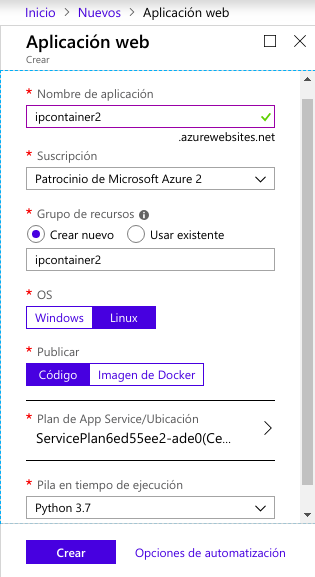
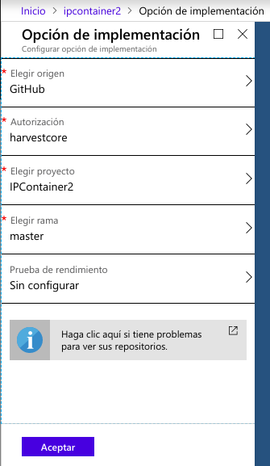
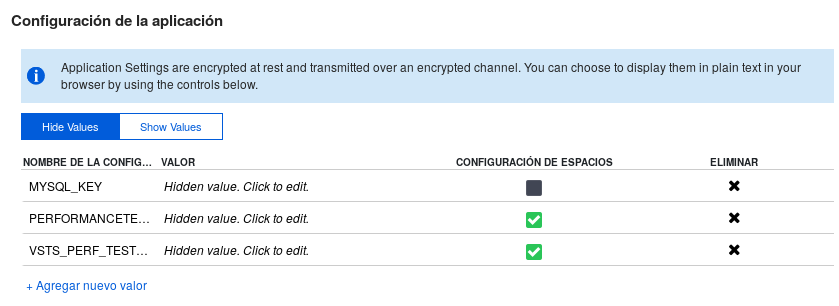

# Despliegue en Azure

`Inactivo` [Link a IPContainer en Azure](https://ipcontainer.azurewebsites.net/).

------

## Procedimiento

1. Registro en [Azure](https://azure.microsoft.com/es-es/) (con el correo que tiene el crédito que nos ha proporcionado [JJ](https://github.com/jj)).
2. Crear una app web.

3. Configurar despliegue con GitHub.

4. En mi caso configuro una variable de entorno, debido a que necesito conexión a una BD.

5. Compruebo que el microservicio está desplegado.

