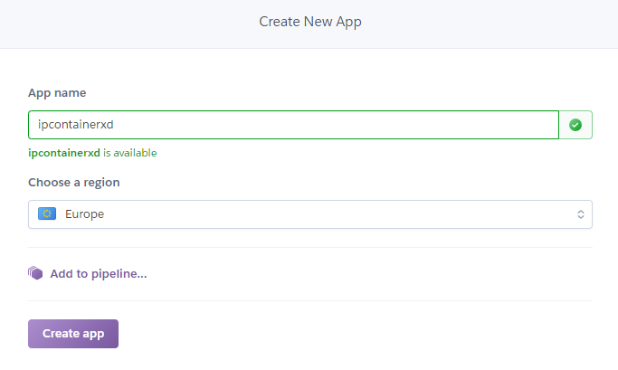
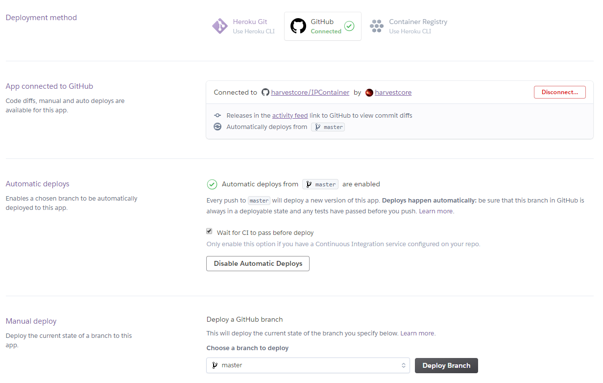
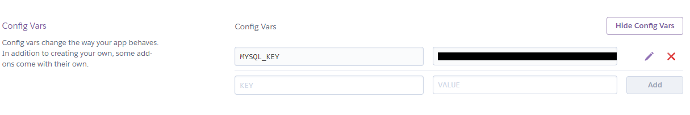
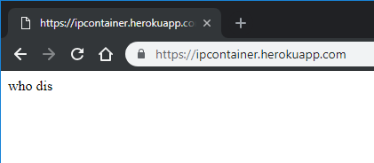

# Despliegue en Heroku


[Link a IPContainer en Heroku](https://ipcontainer.herokuapp.com/).

---

## Procedimiento

1. Registro en [Heroku](https://www.heroku.com/).
2. Crear una app.



3. Configurar despliegue con GitHub.



4. En mi caso configuro una variable de entorno, debido a que necesito conexión a una BD.



5. Creo archivo Procfile con el siguiente contenido y lo añado al repositorio.

```bash
web: gunicorn app:app
```

6. Añado a *requirements.txt* la librería *gunicorn*, que es la que usará Heroku para desplegar IPContainer.

7. Compruebo que el microservicio está desplegado.

