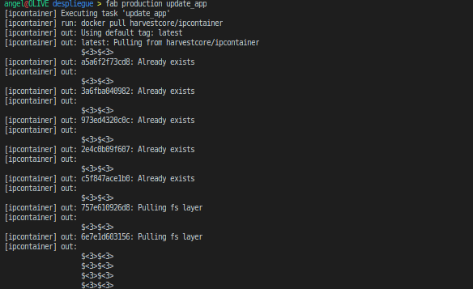
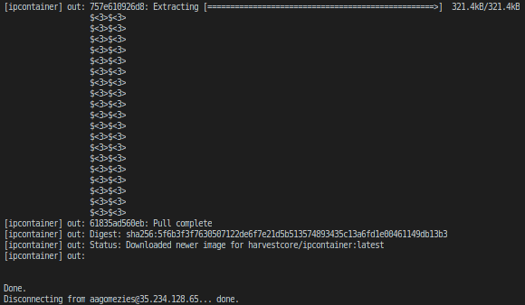
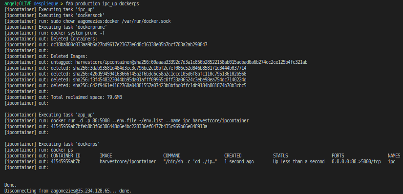

# Despliegue con Fabric
Para el despliegue del microservicio he usado [Fabric](https://get.fabric.io/), una herramienta que se puede usar como librería o en la línea de órdenes.

El *fabfile* que he creado es el siguiente:
```python
from fabric.api import *

# Uso la configuración de hosts de SSH.
env.use_ssh_config = True

# Defino la máquina de staging.
def staging():
    env.hosts = ['ubuntu']

# Defino la máquina de producción.
def production():
    env.hosts = ['ipcontainer']

# Iniciar el contenedor con el microservicio.
def app_up():
    run('docker run -d -p 80:5000 --env-file ~/env.list --name ipc harvestcore/ipcontainer')

# Parar contenedor con el microservicio.
def app_down():
    run('docker stop ipc')

# Cambiar permisos del socker de Docker.
def dockersock():
    run('sudo chown aagomezies:docker /var/run/docker.sock')

# Docker prune, para limpiar contenedores antiguos.
def dockerprune():
    run('docker system prune -f')

# Docker images, para consultar las imágenes existentes.
def dockerimages():
    run('docker images')

# Docker ps, para consultar los contenedores en ejecución.
def dockerps():
    run('docker ps')

# Descarga del contenedor.
def update_app():
    run('docker pull harvestcore/ipcontainer')

# Iniciar microservicio.
# 1. Cambio permisos socket.
# 2. Ejecuto docker prune.
# 3. Arranco el contenedor.
def ipc_up():
    execute(dockersock)
    execute(dockerprune)
    execute(app_up)

# Apago el microservicio.
def ipc_down():
    execute(app_down)
```

La configuración de los hosts (~/.ssh/config) es la siguiente:
```bash
ServerAliveInterval 30

# Máquina de staging
Host ubuntu
        HostName 192.168.56.105
        User ubuntu
        IdentityFile ~/.ssh/id_rsa

# Máquina de producción
Host ipcontainer
        HostName 35.246.104.37
        User aagomezies
        IdentityFile ~/.ssh/id_rsa
```

El uso de fabric es el siguiente:
```bash
fab <máquina> [comandos]
```

Algunos ejemplos:
- Hacer un docker prune en la máquina de staging: `fab staging dockerprune`
- Actualizar imagen microservicio: `fab production update_app`
- Arrancar microservicio y ejecutar docker ps: `fab production ipc_up dockerps`

### Despliegue de la app

#### Actualizo la imagen Docker




#### Arranco el microservicio

