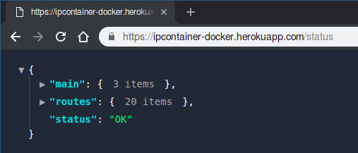

# Docker

## Creación del contenedor

[**Repositorio en DockerHub**](https://hub.docker.com/r/harvestcore/ipcontainer)

Primero he creado el *Dockerfile*:

```dockerfile
FROM python:3.6

COPY . ./ipc

RUN pip install --upgrade pip
RUN cd ./ipc && pip3 install -r requirements.txt

ENV SECRET_KEY=
ENV MYSQL_KEY=

EXPOSE 5000

CMD cd ./ipc && python3 application.py
```

Las variables de entorno las oculto por motivos obvios.

Para crear la imagen:

```bash
docker image build -t harvestcore/ipcontainer .
```

Login en Docker y push de la imagen:

```bash
docker login
docker push harvestcore/ipcontainer
```

Al ejecutar el contenedor se le tiene que pasar como variable de entorno el puerto que usará Flask:

```bash
docker run -e PORT=5000 harvestcore/ipcontainer
```

Por defecto está abierto el puerto 5000.


## Despliegue en Heroku

[Despliegue del contenedor Docker en Heroku](https://ipcontainer-docker.herokuapp.com/)

En primer lugar instalo el cliente de Heroku. Tras esto me logeo en Heroku...

```bash
heroku login
```

... y en el registro de contenedores:

```bash
heroku container:login
```

Tras esto creo una nueva aplicación en Heroku (la llamo *ipcontainer-docker*) y hago un push del contenedor:

```bash
heroku container:push web --app ipcontainer-docker
```

Una vez está subido publico la app:

```bash
heroku container:release web --app ipcontainer-docker
```

---

Debido a que Heroku asigna un puerto arbitrario al contenedor, debemos ejecutar Flask tomando el puerto de la variable de entorno que crea Heroku. En mi caso queda de la siguiente forma:

```python
if __name__ == "__main__":
    if 'PORT' in os.environ: p = os.environ['PORT']
    else: p = 5000

    app.run(host="0.0.0.0", port=p)
```

Por otro lado Heroku no tiene en cuenta los `EXPOSE` del *Dockerfile*, por lo que no tienen especial relevancia aquí.

---

Para comprobar el log de la aplicación uso:

```bash
heroku logs -t --app ipcontainer-docker
```

---

Finalmente compruebo que el [despliegue](https://ipcontainer-docker.herokuapp.com/) funciona correctamente:

