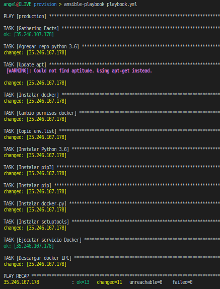

# Provisionamiento con Ansible

Para este cometido he utilizado [Ansible](https://www.ansible.com/), una herramienta bastante sencilla que permite aprovisionar la máquina virtual de una forma muy sencilla.

En primer lugar he definido en un archivo (llamado *hosts*) las diferentes máquinas que Ansible podrá aprovisionar.

```bash
[staging]
192.168.56.105

[production]
35.246.104.37
```

Entre corchetes se coloca el nombre de la máquina o grupo de máquinas, y debajo las direcciones IP de las mismas. En mi caso tengo dos máquinas:
- **staging**: Máquina virtual local con la que he ido haciendo pruebas tanto de provisionamiento como de despliegue.
- **production**: Máquina virtual en Google Cloud que uso como máquina de producción.

Por otro lado he creado el siguiente *playbook* (de formato *.ylm*), que contiene las dependencias, software y demás configuración a instalar en la VM.

```yaml
---

# Hosts a los que conectarse para realizar el provisionamiento.
- hosts: production

  # Usuario a utilizar.
  remote_user: aagomezies

  # Tareas a realizar.
  tasks:

    # Puesto que la imagen de Ubuntu (16.04LTS) por defecto no incluye Python 3.6, agrego el repositorio donde se
    # encuentra para poder instalarlo más tarde.
    #
    # become: true Indica que tiene que convertirse en superusuario para poder realizar tal tarea.
    # [Ref 1] [Ref 2]
    - name: Agregar repo python 3.6
      become: true
      apt_repository: repo=ppa:deadsnakes/ppa state=present

    # Actualizo apt.
    - name: Update apt
      become: true
      apt:
        upgrade: yes
        update_cache: yes

    # Instalo docker, pues la aplicación la voy a ejecutar en docker.
    - name: Instalar docker
      become: true
      apt: pkg=docker.io state=present

    # Cambio los permisos del socket de docker para poder usar docker sin problema alguno. [Ref 4]
    - name: Cambio permisos docker
      become: true
      file: path=/var/run/docker.sock owner=aagomezies group=docker

    # Copio archivo con las variables de entorno. Este archivo se le pasará como argumento a docker run al iniciar el contenedor. [Ref 5]
    - name: Copio env.list
      copy: src=./env.list dest=/home/aagomezies owner=aagomezies group=aagomezies

    # Instalo Python 3.6.
    - name: Instalar Python 3.6
      become: true
      apt: pkg=python3.6 state=present

    # Instalo pip3.
    - name: Instalar pip3
      become: true
      apt: pkg=python3-pip state=latest

    # Instalo pip.
    - name: Instalar pip
      become: true
      apt: pkg=python-pip state=latest

    # Instalo docker-py. [Ref 6]
    - name: Instalar docker-py
      become: true
      pip: name=docker-py state=latest

    # Instalo setuptools.
    - name: Instalar setuptools
      become: true
      pip: name=setuptools state=latest

    # Ejecuto el servicio de docker. [Ref 3]
    - name: Ejecutar servicio Docker
      become: true
      service: name=docker state=started

    # Descargo el contenedor que contiene IPContainer. [Ref 7]
    - name: Descargar docker IPC
      docker_image: name=harvestcore/ipcontainer state=present
```

Finalmente para ejectuar el provisionamiento ejecuto lo siguiente:
```bash
ansible-playbook playbook.yml
```

Por otro lado se puede agregar el provisionamiento al *Vagrantfile*:
```ruby
config.vm.provision "ansible" do |ansible|
    ansible.playbook = "playbook.yml"
end
```

Y se ejecutaría de la siguiente manera:
```bash
vagrant provision
```

### Provisionamiento




### REFERENCIAS

Para aprender a usar y manejar Ansible he utilizado la [documentación](https://docs.ansible.com/) oficial y [ésta](https://www.youtube.com/watch?v=slNIwBPeQvE&list=PLTd5ehIj0goP2RSCvTiz3-Cko8U6SQV1P) serie de vídeos. Los vídeos los he usado para familiarizarme más con la herramienta y para comprender mejor sus capacidades.

[Ref 1](https://docs.ansible.com/ansible/latest/modules/apt_module.html) De aquí saco como usar el paquete apt.
[Ref 2](https://docs.ansible.com/ansible/latest/user_guide/become.html#id1) De aquí saco como hacerme administrador para ejecutar una orden.
[Ref 3](https://docs.ansible.com/ansible/latest/modules/service_module.html) De aquí saco como manejar servicios.
[Ref 4](https://docs.ansible.com/ansible/latest/modules/list_of_files_modules.html) De aquí saco como manejar el paquete de manejo de ficheros (en este caso permisos).
[Ref 5](https://docs.ansible.com/ansible/latest/modules/copy_module.html) De aquí saco como manejar el paquete para copiar archivos.
[Ref 6](https://docs.ansible.com/ansible/latest/modules/pip_module.html) De aquí saco como instalar paquetes para python.
[Ref 7](https://docs.ansible.com/ansible/latest/modules/docker_image_module.html) De aquí saco como usar el paquete de docker.