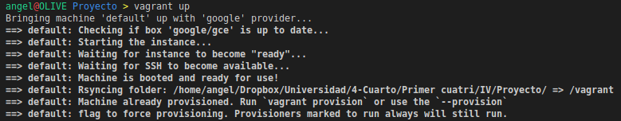
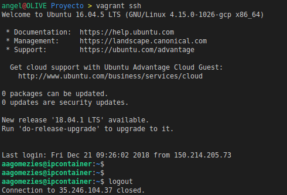
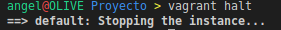

# Vagrant y Google Cloud
El IAAS que he utilizado para el despliegue final es Google Cloud, manejado a través de su interfaz web y desde [Vagrant](https://www.vagrantup.com/). Para crear la instancia, conectarme a ella por SSH, aprovisionarla y demás he usado el siguiente *Vagrantfile*:

```ruby
Vagrant.configure("2") do |config|
    # Tipo de máquina.
    config.vm.box = "google/gce"

    config.vm.provider :google do |google, override|
        # ID del proyecto.
        google.google_project_id = ENV['PROJECT_ID']
        
        # Email del cliente de google.
        google.google_client_email = ENV['CLIENT_EMAIL']

        # JSON con información de la cuenta de Google Cloud, proyecto y demás.
        google.google_json_key_location = ENV['JSON_KEY_LOCATION']
        
        # Configuración de la máquina.
        # Imagen: Ubuntu 16.04 LTS
        # Zona donde se ubica la VM: Oeste de Europa (Londres)
        # Nombre de la VM: ipcontainer
        # Características de la VM: 1 Core, 1,7GB de RAM y 10GB de HDD.
        google.image_family = 'ubuntu-1604-lts'
        google.zone = 'europe-west2-a'
        google.name = 'ipcontainer'
        google.machine_type = 'g1-small'
        
        # Configuración del usuario y private_key para conectarme por SSH.
        override.ssh.username = 'aagomezies'
        override.ssh.private_key_path = '~/.ssh/id_rsa'
    end

    # Provisionamiento con un playbook de Ansible.
    config.vm.provision "ansible" do |ansible|
      ansible.playbook = "provision/playbook.yml"
    end
end
```

Para crear la máquina por primera vez ejecuto:
```bash
vagrant up --provider=google
```

Una vez iniciada la máquina virtual le introduzco mi clave pública SSH (desde la interfaz web) y espero a que termine la instalación de la misma.

Tras terminar la máquina es completamente funcional, algunos comandos que puedo usar ahora son:
```bash
# Iniciar la VM
vagrant up

# Conectarme por SSH
vagrant ssh

# Aprovisionar la VM
vagrant provision

# Apagar la máquina
vagrant halt
```

### Capturas

#### vagrant up


#### vagrant ssh


#### vagrant halt
