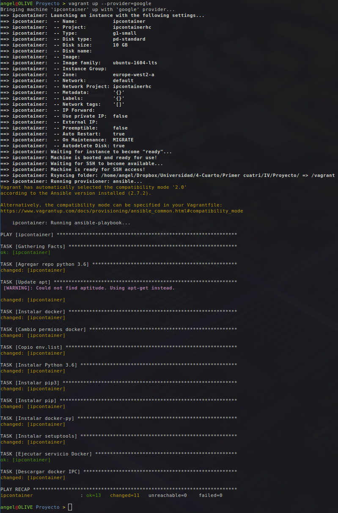

# Vagrant y Google Cloud
El IAAS que he utilizado para el despliegue final es Google Cloud, manejado a través de su interfaz web y desde [Vagrant](https://www.vagrantup.com/). Para crear la instancia, conectarme a ella por SSH, aprovisionarla y demás he creado el siguiente *Vagrantfile*:

```ruby
# -*- mode: ruby -*-
# vi: set ft=ruby :

# [Ref 0]

# [Ref 12]
# Versión 2 de la API de Vagrant.
Vagrant.configure("2") do | config |

  # Defino una máquina "ipcontainer". Definir una máquina me permite realizar configuraciones exclusivamente para ella, además de que en caso de agregar más máquinas en este Vagrantfile éstas quedarian diferenciadas. Por otro lado el nombre que asigno a la máquina es el que se usará como host a la hora de realizar el provisionamiento con Ansible.
  config.vm.define "ipcontainer" do | ipcontainer |
    
    # [Ref 1]
    # Tipo de máquina base.
    config.vm.box = "google/gce"

    # Versión de la máquina base. Elijo 0.1.0 porque no hay otra más actualizada.
    config.vm.box_version = "0.1.0"

    # Evito que Vagrant busque actualizaciones de la máquina base cada vez que arranque la máquina, debido a que la versión 0.1.0 es la única estable hasta la fecha.
    config.vm.box_check_update = false

    # Configuración de la máquina "ipcontainer" con Google Cloud.
    # Uso la variable gcloud para referirme a la configuración de GC y override para sobreescribir la configuración de SSH de Vagrant, para que use el usuario que quiero (aagomezies y ~/.ssh/id_rsa).
    ipcontainer.vm.provider "google" do | gcloud, override |

      # Configuración de las credenciales de Google Cloud.

      # [Ref 2] [Ref 11]
      # ID del proyecto.
      gcloud.google_project_id = ENV['PROJECT_ID']

      # [Ref 3]
      # "Email" del cliente de google.
      gcloud.google_client_email = ENV['CLIENT_EMAIL']

      # [Ref 4]
      # JSON con información de la cuenta de Google Cloud, proyecto y demás.
      gcloud.google_json_key_location = ENV['JSON_KEY_LOCATION']
      
      # [Ref 5]
      # Configuración de la máquina.
    
      # [Ref 6]
      # Imagen: Ubuntu 16.04 LTS
      gcloud.image_family = 'ubuntu-1604-lts'

      # [Ref 7]
      # Zona donde se ubica la VM: Oeste de Europa (Londres)
      gcloud.zone = 'europe-west2-a'

      # Nombre de la VM: ipcontainer
      gcloud.name = 'ipcontainer'

      # [Ref 8]
      # Características de la VM: 1 Core, 1,7GB de RAM y 10GB de HDD.
      gcloud.machine_type = 'g1-small'
      
      # [Ref 9]
      # Configuración del usuario y private_key para conectarme por SSH.
      override.ssh.username = "aagomezies"
      override.ssh.private_key_path = '~/.ssh/id_rsa'
    end
  
    # [Ref 10]
    # Provisionamiento con un playbook de Ansible.
    config.vm.provision "ansible" do | ans |
      ans.playbook = "provision/playbook.yml"
    end
  end
end
```

Para crear la máquina por primera vez ejecuto:
```bash
vagrant up --provider=google
```

Una vez iniciada la máquina virtual le introduzco mi clave pública SSH (desde la interfaz web) y espero a que termine la instalación de la misma. También habilito el tráfico del puerto 80, ya que desde no se puede hacer aún desde el Vagrantfile (el plugin no está actualizado).

Tras terminar la máquina es completamente funcional, algunos comandos que puedo usar ahora son:
```bash
# Iniciar la VM
vagrant up

# Conectarme por SSH
vagrant ssh

# Aprovisionar la VM (si no se ha aprovisionado al crear la VM)
vagrant provision

# Apagar la máquina
vagrant halt
```

### Capturas

#### Creación de la máquina y provisionamiento


#### vagrant up


#### vagrant ssh


#### vagrant halt


### REFERENCIAS
Para confeccionar el vagrantfile y demás configuración he usado la [documentación](https://github.com/mitchellh/vagrant-google) del repositorio del creador del plugin de Google Cloud para Vagrant, además de varios issues ya resueltos que se encuentran en el mismo repo. Por otro lado, [aquí](https://cloud.google.com/iam/docs/creating-managing-service-account-keys) ha sido donde he encontrado la información relacionada con las claves de mi cuenta en Google Cloud.

- [Ref0](https://github.com/mitchellh/vagrant-google) Para instalar el plugin de Google Cloud para Vagrant ejecuto: `vagrant plugin install vagrant-google`
- [Ref1](https://app.vagrantup.com/boxes/search?provider=google) Aquí hay una lista de máquinas base compatibles con Google Cloud. Elijo *google/gce* por que es la más básica compatible con Google Compute Engine (el tipo de recurso que creo para el despliegue).
- [Ref2](https://support.google.com/googleapi/answer/7014113?hl=en) El *project_id* se asigna al crear un proyecto en Google Cloud, este ID lo asigna el usuario. En el link hay información sobre dónde localizarlo (una vez creado el proyecto en la consola web o desde el cliente se encuentra fácilmente).
- [Ref3](https://cloud.google.com/iam/docs/understanding-service-accounts) Esta clave (que tiene forma de email) es la que nos permite conectarnos al servicio de Google Cloud para poder realizar cualquier operación. Se encuentra en el cliente web en el apartado *Cuentas de servicio*.
- [Ref4](https://cloud.google.com/iam/docs/creating-managing-service-account-keys) Este archivo JSON contiene todas las credenciales, claves y demás registros necesarios para poder hacer cualquier cosa en el proyecto. En este caso para poder crear una VM, modificar sus parámetros y poder acceder a ella. Se crea en el cliente web, en el apartado *APIs y servicios > Credenciales*. Por otro lado este archivo también contiene los dos campos anteriormente mencionados (*project_id* y *client_email*).
- [Ref5](https://github.com/mitchellh/vagrant-google#configuration) Aquí hay una lista de configuraciones aplicables a la VM. Agrego las que necesito.
- [Ref6](https://cloud.google.com/compute/docs/images) Listado con todas las imágenes disponibles. Elijo Ubuntu 16.04 LTS, razón [aquí](desplieguefinal.md).
- [Ref7](https://cloud.google.com/compute/docs/regions-zones/) Listado con todas las regiones disponibles. Elijo *europe-west2-a* por cercanía.
- [Ref8](https://cloud.google.com/compute/docs/machine-types) Listado con todos los tipos de máquinas disponibles para Google Compute Engine. Elijo *g1-small* porque es suficiente para ejecutar lo que necesito y porque es bastante barata.
- [Ref9](https://github.com/mitchellh/vagrant-google#ssh-support) Aquí entiendo como configurar SSH para utilizar mi usuario y mi clave. En caso de no hacer esto, Vagrant intentaría crear un usuario llamado *vagrant* con una clave SSH generada para éste usuario. *aagomezies* es el usuario que tengo en Google Cloud, proviene del email que uso para registrarme en GC. La clave SSH es la generada para ese email en concreto.
- [Ref10](https://www.vagrantup.com/docs/provisioning/ansible.html) Aquí entiendo cómo agregar el provisionamiento de *Ansible* en el *Vagrantfile*.
- [Ref11](https://ruby-doc.org/core-2.1.4/ENV.html) Aquí entiendo como usar variables de entorno en Ruby.
- [Ref12](https://www.sitepoint.com/vagrantfile-explained-setting-provisioning-shell/) Aquí he entendido la estructura básica de un Vagrantfile y otros conceptos básicos.